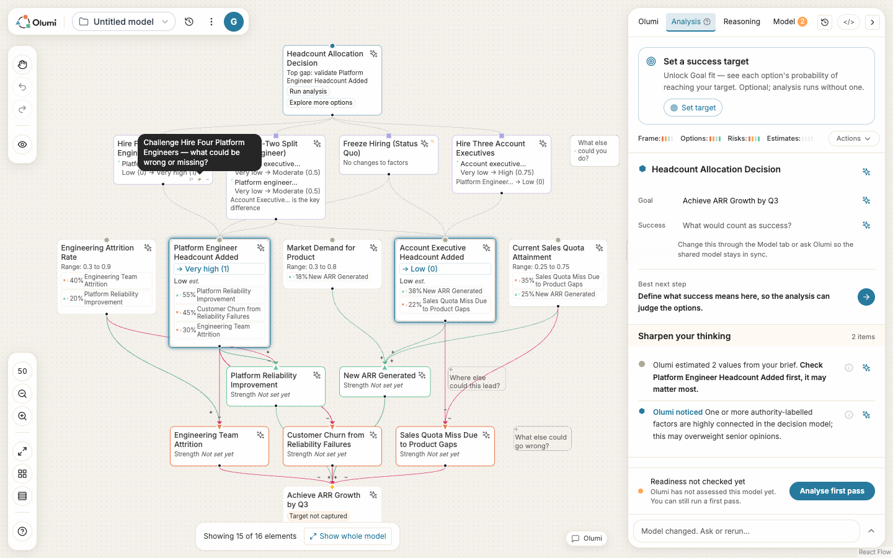
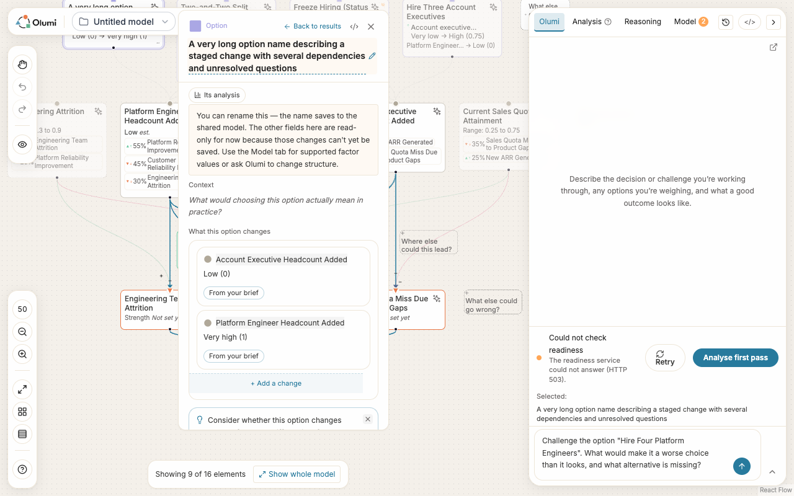

# Option node V3 — pragmatic PoC design

**Status: application refinement, locally validated; not deployed.**
This is the reference for the implementation on
`codex/option-node-v3-refinements`, based on staging `25164b1e`.
V1 and V2 remain historical comparisons. V3 replaces their proposed option
families and quantitative card layout for this implementation; it does not
claim to deliver every part of the longer-term reasoning experience.

## Purpose and scope

Help a person understand an option, ask Olumi about it, challenge it and open
its details without crowding the graph. Preserve the existing node size,
top-centre type shape, graph connections and canvas typography. The target
is desktop, with pointer and keyboard access.

The immediate improvement is interaction clarity. Richer reasoning indicators
are recorded below as separate work, so their absence is explicit rather than
mistaken for a design decision to discard them.

## Node and inspector contract

| Surface | V3 behaviour | Reason |
|---|---|---|
| Node at rest | Retain the option title, existing supporting text and existing metadata. Keep the type shape above the card. Add no permanent probability, quantity comparison or coaching paragraph. | Preserve graph density and familiar positions. |
| Node on hover or selection | Show up to three icon actions, in order: Ask Olumi, Challenge, More. Keyboard focus also reveals the controls. | Make understanding and challenge directly accessible with minimal text. |
| Body preview | Keep the existing data-backed preview and its 300 ms entry delay. It yields while the action row is hovered or focused. | One explanation surface at a time while choosing an action. |
| Action tooltip | Show the action and full option name on hover or focus; wrap long text, shift or flip at viewport edges. Keep it open while the pointer enters its content. Escape and activation dismiss it. | Icons remain understandable without permanent labels or native-tooltip collisions. |
| Open details | Clicking the node retains its existing inspector route. More → Open details provides an explicit pointer and keyboard route to the same node. | Remove the fourth shortcut without losing access to details. |
| Inspector title | Wrap the full option title across the available width. Place the existing header controls beside the type label. Preserve rename behaviour and limits. | Long names remain readable without widening the inspector or obscuring more graph. |
| Inspector content | Retain the current option fields, their actual values and existing actions. | This slice does not invent additional data or rebuild the inspector. |

The action row is shared by other node types. Those types receive the same
tooltip and menu improvement; their existing capability gates still determine
which actions appear. Title wrapping and the header arrangement apply to
option inspectors only.

## Icon meaning and Olumi interaction

| Existing icon | Meaning | Activation and evidence boundary |
|---|---|---|
| `MessageSquare` | Ask Olumi about this option | Uses the existing explanation request and sends through the registered conversation channel. This is an AI action, not a comment count. |
| `Zap` | Challenge this option: what could be wrong or missing? | Opens the existing option-specific draft for the person to review and send. Clicking it does not send a request or edit the model. |
| `MoreHorizontal` | More actions | Opens the existing node menu. Open details is first; other supported actions remain available. |
| `PanelRight`, in the menu | Open details | Selects the named node and opens its inspector. No AI request. |
| Existing provenance and science glyphs | Their existing status or suggestion meanings | Retained through their current modules. This change does not reinterpret origin as accuracy, review or team agreement. |

Challenge makes a counterargument easy to initiate. It is not evidence that a
bias has been detected, that this is the most valuable issue to resolve, or
that the option has been vetted. This slice improves access to existing
coaching; it introduces no new coaching-selection algorithm and makes no
claim that thinking quality has been measured.

## Ordinary and degraded states

| State | Required behaviour in this slice | Verification |
|---|---|---|
| Long option name | Preserve the compact node; reveal the complete name in the tooltip and wrapped inspector title. | Local browser: approximately 100-character title at 1280 × 800. |
| Missing description | Do not supply invented supporting text. Existing fallback behaviour remains. | Long-name browser fixture has an empty description. |
| No comparable analysis | Do not add a probability, ranking or “this option versus current” display. Keep the existing pre-analysis preview. | Captured starter before analysis. |
| Baseline or real units unknown | Do not render `4 → 6`, a scaled delta or a guessed baseline. | No new quantity or baseline renderer. |
| AI channel unavailable | Hide actions whose existing channel requirements are unmet; keep More and Open details usable. | Component tests and local browser after fixture reload. |
| Body preview and action tooltip compete | Action explanation takes precedence. Returning to the body restarts its normal preview delay. | Component tests and connected-graph browser check. |
| Tooltip near a viewport edge | Reposition and wrap within the viewport. | Actual canvas pan near the top edge. |
| Keyboard use | Focus explains the icon; Escape dismisses the explanation; Enter activates the control. Menu navigation reaches Open details. | Component tests and browser interaction. |
| Canvas zoom changes | Keep tooltip anchored to the actual control. | Browser checks at 50% and 100%. Existing small targets at reduced zoom are an unresolved limitation. |

The slice does not change long-title truncation on the node itself, empty
intervention messaging, warning precedence, stale-result handling or the
meaning of existing count badges. These need their own acceptance checks
before anyone describes them as resolved by V3.

## Design-system changes in this implementation

The [quick reference](../../../../DESIGN_SYSTEM.md) and
[V5 specification](../../../Design/Olumi_Design_System_v5.md) record the same
three-action order, capability gates, tooltip behaviour, preview precedence
and option-title wrapping. The implementation reuses the shared Floating UI
tooltip and existing Lucide icons. No new colours, border meanings, font scale
or option-type taxonomy are introduced.

The shared tooltip's `asChild` mode attaches to the actual button, preserves
its reference and handlers, and blocks inherited native titles with an empty
`title` attribute. It does not add a layout wrapper around the node action.

## Remaining design work and the condition for starting it

| Follow-up | Surface and concrete trigger |
|---|---|
| Visible readiness and reasoning-risk indicators | Node and inspector: start when each candidate signal is traced from the current response through its option attachment to the mounted view. Specify priority, wording, icon budget and an action before adding it. |
| Per-value provenance and input clarity | Inspector: start with a field-by-field map of current draft and analysis adapters. Use the ratified provenance module; keep option origin distinct from value origin. |
| Contextual coaching beyond generic Challenge | Node and inspector: start with a deterministic selection rule for an existing option-specific suggestion, its reason and a dismiss/defer path. Record the coaching method and test its action, without presenting a warning as a diagnosis of the person. |
| Reviewed, vetted and team contribution | Collaboration and contracts: start when explicit review/contribution events identify the actor, target and current version. Never infer consent from silence or provenance. |
| Missing and stale data treatment | Inspector and node preview: start with representative zero-intervention, invalid-value, attached-warning and stale-analysis fixtures; define distinct copy and recovery actions. |
| Target size at reduced zoom | Canvas controls: reopen when testing at normal working zoom shows selection difficulty. Measure the on-screen hit target and nearby edges before changing the geometry. |
| Deployed acceptance | Canvas release: after this change is merged and served, repeat the relevant checks against the identified deployed build, including a real conversation. Local fixtures do not close this requirement. |

## Visual reference and acceptance evidence

See [IMPLEMENTATION.md](IMPLEMENTATION.md) for all eight application captures
and the producer/consumer trace, and [VALIDATION.md](VALIDATION.md) for test
outcomes and limitations. These captures are from the local PoC application
with a captured starter and offline services; they are not a separate card-grid
prototype or evidence of staging deployment.
