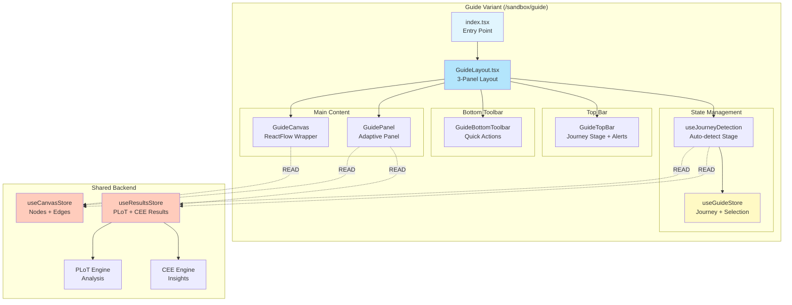
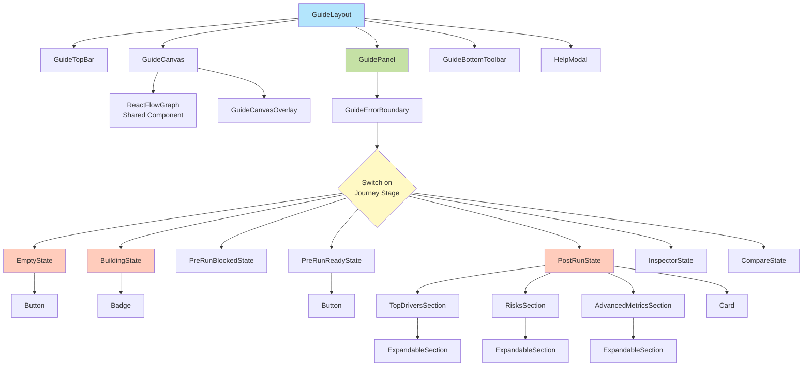
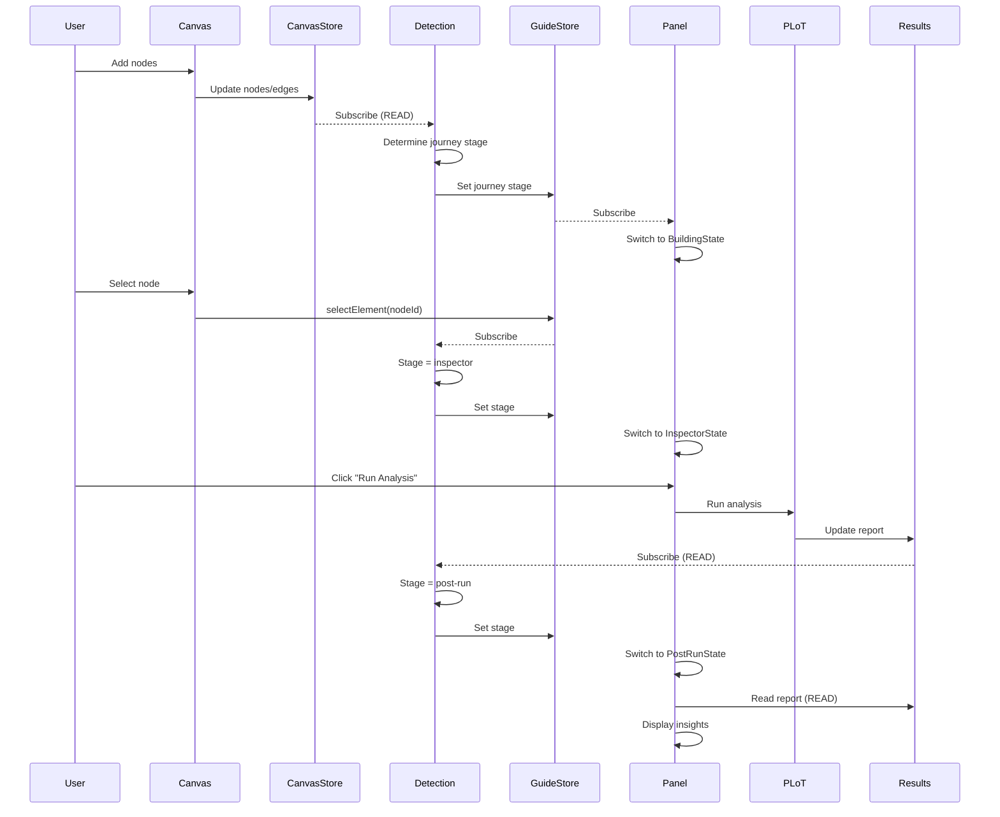
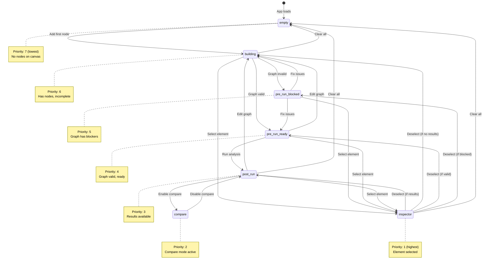
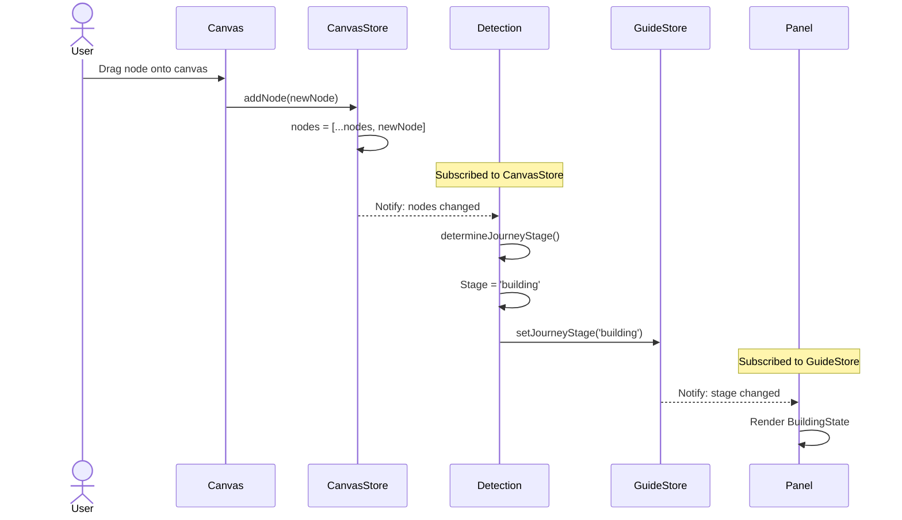
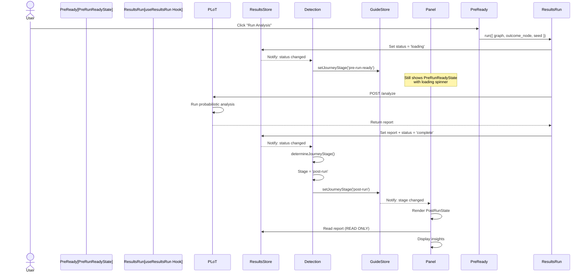
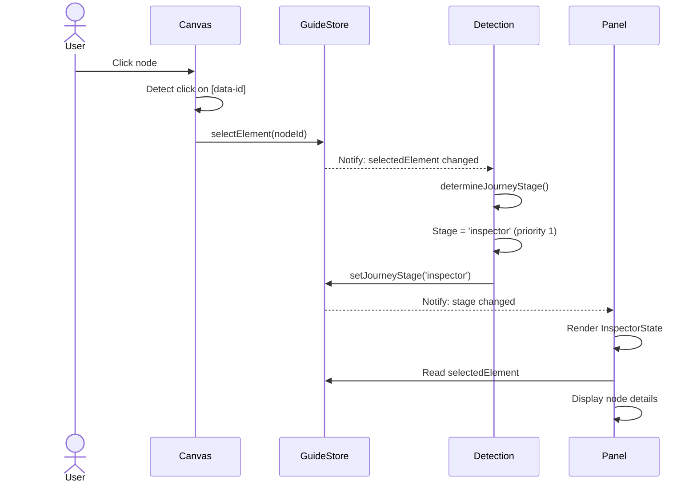
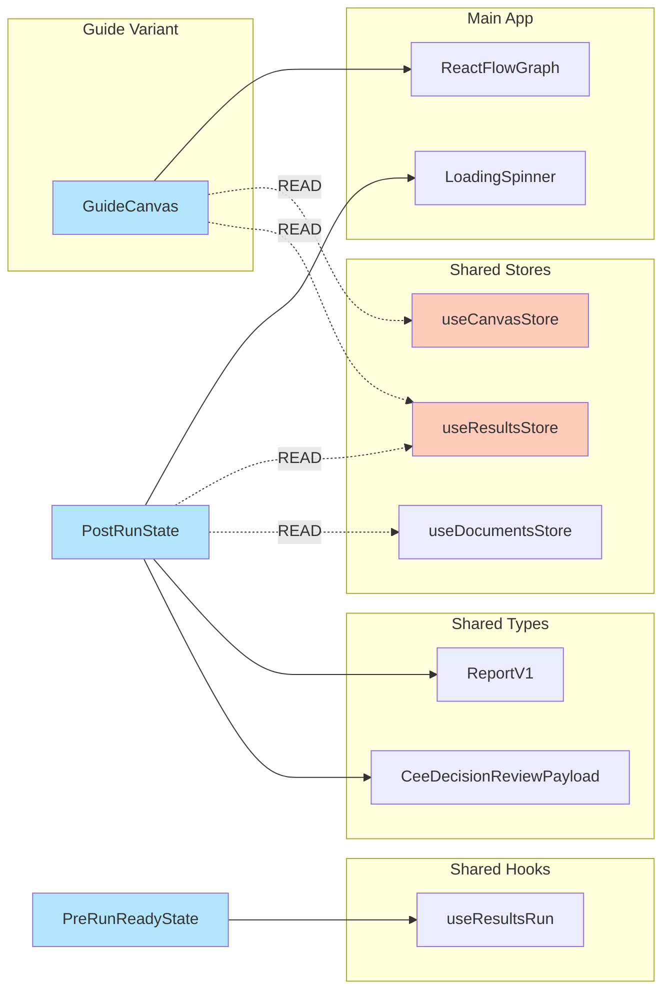
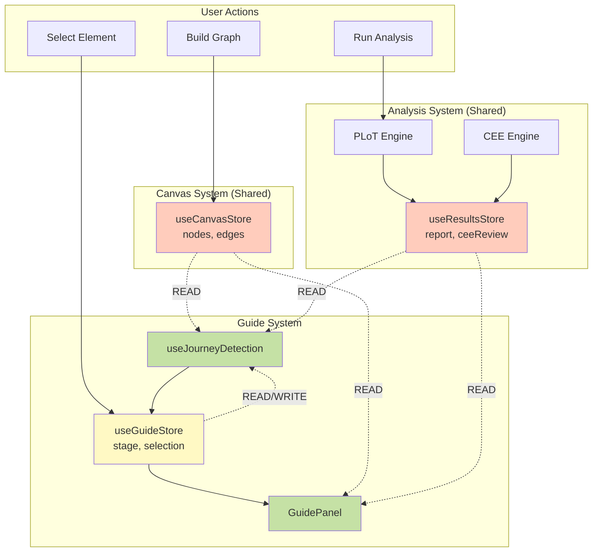
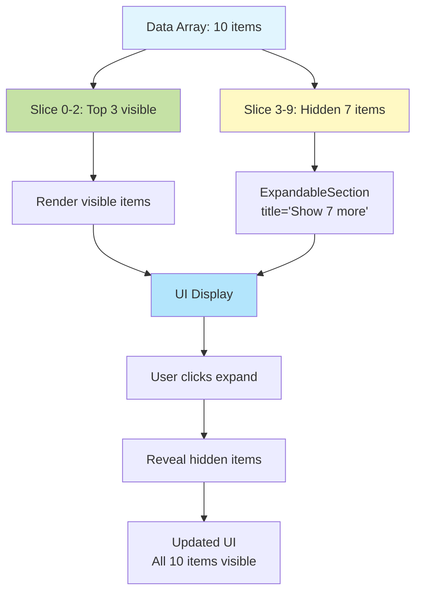

# Architecture - Guide Variant

This document provides a visual and technical overview of the guide variant's architecture, data flow, and component relationships.

## Table of Contents

1. [High-Level Architecture](#high-level-architecture)
2. [Component Hierarchy](#component-hierarchy)
3. [Data Flow](#data-flow)
4. [Journey State Machine](#journey-state-machine)
5. [Store Architecture](#store-architecture)
6. [Event Flow](#event-flow)
7. [Integration Points](#integration-points)

---

## High-Level Architecture



### Key Principles

1. **Isolation**: Guide code in `/sandbox-guide/`, no imports from `/sandbox/`
2. **Read-Only**: Guide reads from shared stores, never writes
3. **Separation**: `useGuideStore` for guide-specific state
4. **Shared Backend**: Reuses PLoT, CEE, canvas, auth from main app

---

## Component Hierarchy



---

## Data Flow



### Data Flow Rules

1. **Canvas Store** → Guide (READ ONLY)
   - Nodes, edges, outcomeNodeId
   - Never modified by guide

2. **Results Store** → Guide (READ ONLY)
   - PLoT report, CEE review, status
   - Never modified by guide

3. **Guide Store** → Guide (READ/WRITE)
   - Journey stage, selected element, compare mode
   - Only modified by guide

4. **Journey Detection** → Auto Updates
   - Subscribes to canvas, results, guide stores
   - Automatically determines journey stage
   - Updates guide store with new stage

---

## Journey State Machine



### Priority Order (Highest to Lowest)

Implementation in `utils/journeyDetection.ts`:

```typescript
export function determineJourneyStage(context: JourneyContext): JourneyStage {
  // 1. Inspector (highest priority)
  if (context.selectedElement) return 'inspector'

  // 2. Compare mode
  if (context.compareMode) return 'compare'

  // 3. Post-run (results available)
  if (context.results.status === 'complete') return 'post-run'

  // 4. Pre-run (graph validation)
  if (context.graph.nodes.length > 0) {
    const blockers = findBlockers(context.graph)
    return blockers.length === 0 ? 'pre-run-ready' : 'pre-run-blocked'
  }

  // 5. Building (has nodes)
  if (context.graph.nodes.length > 0) return 'building'

  // 6. Empty (default)
  return 'empty'
}
```

---

## Store Architecture

```mermaid
graph TB
    subgraph "Guide Store (useGuideStore)"
        CS_State[State]
        CS_Journey[journeyStage: JourneyStage]
        CS_Selected[selectedElement: string | null]
        CS_Panel[panelExpanded: boolean]
        CS_Compare[compareMode: boolean]

        CS_State --> CS_Journey
        CS_State --> CS_Selected
        CS_State --> CS_Panel
        CS_State --> CS_Compare

        CS_Actions[Actions]
        CS_SetJourney[setJourneyStage]
        CS_SelectElem[selectElement]
        CS_ClearSelect[clearSelection]
        CS_TogglePanel[togglePanel]
        CS_SetCompare[setCompareMode]

        CS_Actions --> CS_SetJourney
        CS_Actions --> CS_SelectElem
        CS_Actions --> CS_ClearSelect
        CS_Actions --> CS_TogglePanel
        CS_Actions --> CS_SetCompare
    end

    subgraph "Canvas Store (READ ONLY)"
        CVS_State[State]
        CVS_Nodes[nodes: Node[]]
        CVS_Edges[edges: Edge[]]
        CVS_Outcome[outcomeNodeId: string]

        CVS_State --> CVS_Nodes
        CVS_State --> CVS_Edges
        CVS_State --> CVS_Outcome
    end

    subgraph "Results Store (READ ONLY)"
        RS_State[State]
        RS_Status[status: 'idle' | 'loading' | 'complete' | 'error']
        RS_Report[report: ReportV1]
        RS_CEE[ceeReview: CeeDecisionReviewPayload]

        RS_State --> RS_Status
        RS_State --> RS_Report
        RS_State --> RS_CEE
    end

    Detection[useJourneyDetection Hook]

    CVS_State -.READ.-> Detection
    RS_State -.READ.-> Detection
    CS_State -.READ.-> Detection

    Detection -->|setJourneyStage| CS_SetJourney

    Panel[GuidePanel]
    Inspector[InspectorState]
    PostRun[PostRunState]

    CS_Journey -.subscribe.-> Panel
    CS_Selected -.subscribe.-> Inspector
    RS_Report -.READ.-> PostRun
    CVS_Nodes -.READ.-> PostRun

    style CS_State fill:#fff9c4
    style CVS_State fill:#ffccbc
    style RS_State fill:#ffccbc
    style Detection fill:#c5e1a5
```

---

## Event Flow

### User Adds Node



### User Runs Analysis



### User Selects Node



---

## Integration Points

### Shared Components (from main app)



### Data Flow Between Systems



---

## Progressive Disclosure Pattern



### Implementation Pattern

```typescript
// Data
const drivers = report.drivers // 10 items

// Progressive disclosure
const visibleDrivers = drivers.slice(0, 3)
const hiddenDrivers = drivers.slice(3)

// Render
<>
  {visibleDrivers.map(driver => <DriverRow key={driver.node_id} {...driver} />)}

  {hiddenDrivers.length > 0 && (
    <ExpandableSection title={`Show ${hiddenDrivers.length} more drivers`}>
      {hiddenDrivers.map(driver => <DriverRow key={driver.node_id} {...driver} />)}
    </ExpandableSection>
  )}
</>
```

---

## File Structure Map

```
sandbox-guide/
│
├── index.tsx                     # Entry point (route handler)
├── GuideLayout.tsx             # Main layout orchestrator
│
├── hooks/                        # Custom hooks
│   ├── index.ts                 # Barrel export
│   ├── useGuideStore.ts       # Guide state (Zustand)
│   ├── useJourneyDetection.ts   # Auto-detect journey stage
│   └── useKeyboardShortcuts.ts  # Global keyboard shortcuts
│
├── utils/                        # Business logic
│   ├── index.ts                 # Barrel export
│   └── journeyDetection.ts      # Journey detection algorithms
│
├── types/                        # Type definitions
│   └── guide.types.ts         # Core types (JourneyStage, etc.)
│
├── components/
│   ├── canvas/                  # Canvas enhancements
│   │   ├── GuideCanvas.tsx        # Wrapper for ReactFlowGraph
│   │   └── GuideCanvasOverlay.tsx # Top drivers legend
│   │
│   ├── panel/                   # Adaptive panel
│   │   ├── GuidePanel.tsx         # Container (switches on stage)
│   │   ├── states/                  # 7 journey state components
│   │   │   ├── index.ts            # Barrel export
│   │   │   ├── EmptyState.tsx
│   │   │   ├── BuildingState.tsx
│   │   │   ├── PreRunBlockedState.tsx
│   │   │   ├── PreRunReadyState.tsx
│   │   │   ├── PostRunState.tsx
│   │   │   ├── InspectorState.tsx
│   │   │   └── CompareState.tsx
│   │   └── sections/                # Reusable sections
│   │       ├── index.ts            # Barrel export
│   │       ├── TopDriversSection.tsx
│   │       ├── RisksSection.tsx
│   │       └── AdvancedMetricsSection.tsx
│   │
│   ├── shared/                  # Design system components
│   │   ├── index.ts            # Barrel export
│   │   ├── Badge.tsx
│   │   ├── Button.tsx
│   │   ├── Card.tsx
│   │   ├── ExpandableSection.tsx
│   │   ├── MetricRow.tsx
│   │   ├── HelpModal.tsx
│   │   └── GuideErrorBoundary.tsx
│   │
│   ├── topbar/                  # Top bar
│   │   └── GuideTopBar.tsx
│   │
│   └── toolbar/                 # Bottom toolbar
│       └── GuideBottomToolbar.tsx
│
├── __tests__/                   # Test files
│   ├── hooks/
│   └── utils/
│
└── Documentation
    ├── README.md               # Safety rules, dev commands
    ├── GETTING_STARTED.md      # Quick start guide
    ├── ARCHITECTURE.md         # This file
    ├── STATUS.md               # Comprehensive project status
    └── ACCESSIBILITY.md        # WCAG guidelines
```

---

## Technology Stack

| Layer | Technology | Purpose |
|-------|------------|---------|
| **Framework** | React 18.3.1 | UI library |
| **Language** | TypeScript (strict) | Type safety |
| **State** | Zustand | Lightweight state management |
| **Canvas** | ReactFlow (@xyflow/react) | Graph visualization |
| **Styling** | Tailwind CSS | Utility-first CSS |
| **Testing** | Vitest + React Testing Library | Unit & integration tests |
| **Linting** | ESLint | Code quality |
| **Build** | Vite | Fast dev server |

---

## Design Patterns

### 1. Observer Pattern (Store Subscriptions)

Components subscribe to stores and automatically re-render on changes:

```typescript
// Component subscribes to specific state
const journeyStage = useGuideStore((state) => state.journeyStage)
const nodes = useCanvasStore((state) => state.nodes)

// Re-renders when journeyStage or nodes change
```

### 2. State Machine Pattern (Journey Stages)

Journey detection implements a priority-based state machine:

```typescript
// Priority order determines current state
if (selectedElement) return 'inspector'        // Priority 1
if (compareMode) return 'compare'              // Priority 2
if (hasResults) return 'post-run'              // Priority 3
// ... etc
```

### 3. Container/Presentational Pattern

- **Containers**: `GuidePanel`, `GuideCanvas` (manage state)
- **Presentational**: All panel states, shared components (receive props)

### 4. Adapter Pattern (Canvas Integration)

`GuideCanvas` wraps `ReactFlowGraph` and adds guide-specific features:

```typescript
export function GuideCanvas() {
  return (
    <div ref={canvasRef}>
      <ReactFlowGraph />  {/* Shared component, unmodified */}
      {hasResults && <GuideCanvasOverlay />}  {/* Guide enhancement */}
    </div>
  )
}
```

### 5. Progressive Disclosure Pattern

All lists show max 7 items, hide rest behind `<ExpandableSection>`:

```typescript
const visible = items.slice(0, 3)
const hidden = items.slice(3)

return (
  <>
    {visible.map(...)}
    {hidden.length > 0 && (
      <ExpandableSection title={`Show ${hidden.length} more`}>
        {hidden.map(...)}
      </ExpandableSection>
    )}
  </>
)
```

---

## Performance Considerations

### Zustand Optimizations

- O(1) selector lookups
- Only re-render on selected state changes
- No unnecessary re-renders

### React Optimizations

- Minimal component nesting
- No React.memo needed (fast renders)
- useEffect dependencies carefully managed

### Journey Detection

- Runs only when relevant state changes
- Lightweight computation (<1ms)
- No polling or intervals

---

## Security & Safety

### Code Isolation

- All guide code in `/sandbox-guide/`
- ESLint rule prevents imports from `/sandbox/`
- Verification script: `./scripts/verify-guide-safety.sh`

### Read-Only Access

- Guide never writes to `useCanvasStore`
- Guide never writes to `useResultsStore`
- Only writes to `useGuideStore` (isolated)

### Feature Flag

- Behind `VITE_GUIDE_ENABLED` environment variable
- No impact on main app if disabled
- Route `/sandbox/guide` only accessible when enabled

---

## Related Documentation

- [GETTING_STARTED.md](./GETTING_STARTED.md) - Quick start guide
- [STATUS.md](./STATUS.md) - Comprehensive project status
- [ACCESSIBILITY.md](./ACCESSIBILITY.md) - WCAG guidelines
- [components/shared/README.md](./components/shared/README.md) - Component library
- [components/panel/states/README.md](./components/panel/states/README.md) - State machine guide

---

**Questions?** File an issue with label `guide-variant` or `architecture`.
