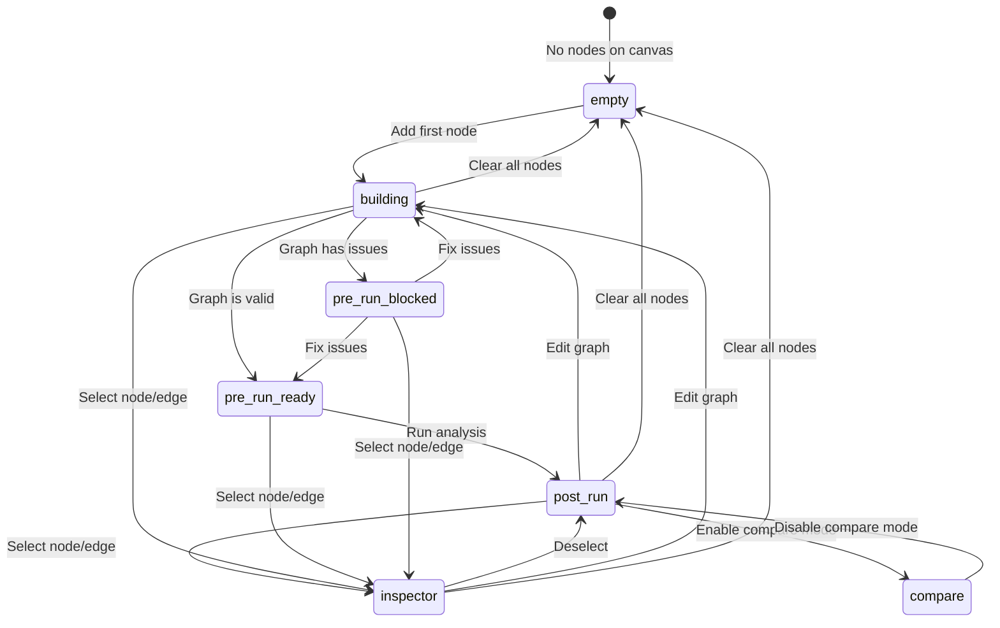

# Panel States - Journey State Machine

This directory contains the 7 panel state components that power the adaptive guide panel.

## Overview

The guide panel automatically switches its content based on the user's **journey stage**. Each stage has a dedicated component that renders contextually relevant content.

## Journey State Machine



## State Priority Order

Journey detection follows this priority (highest to lowest):

1. **inspector** - User has selected a node or edge
2. **compare** - Compare mode is active
3. **post-run** - Analysis results available
4. **pre-run-ready** - Graph valid and ready to run
5. **pre-run-blocked** - Graph has blockers preventing run
6. **building** - Graph has nodes but incomplete
7. **empty** - No nodes on canvas (default)

See `utils/journeyDetection.ts` for implementation.

## Panel State Components

### 1. EmptyState

**File**: `EmptyState.tsx`
**When**: No nodes on canvas
**Purpose**: Welcome new users and provide getting-started guidance

**Content**:
- Three CTAs: Templates, Draft with AI, Build manually
- Quick guide explaining how to build a model
- Example prompts for inspiration

**Key Features**:
- "Build manually" CTA adds initial outcome node
- Templates and AI chat are placeholders (TODOs tracked)

**Design Pattern**: Inviting, low-friction entry point

---

### 2. BuildingState

**File**: `BuildingState.tsx`
**When**: User is actively building the graph
**Purpose**: Show progress and guide next steps

**Content**:
- 4-step progress checklist (outcome, decision, factors, connections)
- Visual progress bar with percentage
- Smart next suggestion based on what's missing
- Contextual guidance for each step
- Encouragement messages as progress increases

**Key Features**:
- Reads graph structure from `useCanvasStore`
- Detects completion of each step (outcome node, decision node, factors, edges)
- Progress: 0% (empty) → 25% → 50% → 75% → 100% (complete)

**Design Pattern**: Positive reinforcement, clear next action

---

### 3. PreRunBlockedState

**File**: `PreRunBlockedState.tsx`
**When**: Graph has validation errors
**Purpose**: Show specific blockers preventing analysis

**Content**:
- List of blockers (e.g., "Add an outcome node", "Connect at least one factor")
- Helpful CTAs to fix each issue
- Educational tips about evidence and model structure

**Key Features**:
- Uses `findBlockers()` from `utils/journeyDetection.ts`
- Never shows if graph is valid (would contradict ready state)
- Blockers are specific and actionable

**Design Pattern**: Clear error communication with recovery actions

**Blockers Detected**:
- No outcome node
- No decision node
- No factors
- Factors not connected
- Invalid graph structure

---

### 4. PreRunReadyState

**File**: `PreRunReadyState.tsx`
**When**: Graph is valid and ready to analyze
**Purpose**: Encourage user to run analysis

**Content**:
- "Ready to analyze!" confirmation
- Graph statistics (X nodes, Y edges)
- Working "Run Analysis" button
- Tips about evidence and how analysis works

**Key Features**:
- Wired to `useResultsRun()` hook
- Button triggers PLoT + CEE analysis
- Shows loading state while running
- Graph stats calculated from canvas store

**Design Pattern**: Positive confirmation with clear CTA

---

### 5. PostRunState

**File**: `PostRunState.tsx`
**When**: Analysis results available
**Purpose**: Display rich insights from PLoT + CEE

**Content**:
- Headline from CEE (story.headline)
- Outcome with range visualization
- Confidence meter with expandable details
- Top 3 drivers (expandable for more)
- Risks with expandable list
- Next suggested actions
- Advanced metrics (graph quality, critique) - collapsed by default

**Key Features**:
- **Full data wiring** to PLoT and CEE stores
- **Progressive disclosure** - max 7 items visible, rest expandable
- **Safety guarantee** - never shows blockers + positive outcomes together
- **Context everywhere** - all numbers have labels, baselines, units
- Uses reusable sections: `TopDriversSection`, `RisksSection`, `AdvancedMetricsSection`

**Design Pattern**: Rich insights with progressive disclosure

**Data Sources**:
- PLoT: `results`, `confidence`, `drivers`, `insights`, `graph_quality`, `critique`
- CEE: `story.headline`, `story.key_drivers`, `story.next_actions`

---

### 6. InspectorState

**File**: `InspectorState.tsx`
**When**: User selected a node or edge
**Purpose**: Show detailed properties of selected element

**Content**:

**For Nodes**:
- Type badge (outcome, decision, factor)
- Label and description
- Prior probability (if applicable)
- Utility value (if applicable)
- Action buttons (edit, view connections, add evidence)

**For Edges**:
- Source → Target path
- Edge weight and confidence
- Evidence count
- Action buttons (edit weight, add evidence)

**Key Features**:
- Dual mode: node vs edge inspection
- Close button to return to main journey
- Reads `selectedElement` from `useGuideStore`
- Finds element data from canvas stores

**Design Pattern**: Focused inspector with clear exit

---

### 7. CompareState

**File**: `CompareState.tsx`
**When**: Compare mode is active
**Purpose**: Compare multiple analysis results (future feature)

**Content**:
- Placeholder text explaining feature is coming soon
- Exit button to return to main journey

**Key Features**:
- Ready for future implementation
- Documented in STATUS.md as Phase 4+ work

**Design Pattern**: Placeholder with clear intent

---

## How to Add a New Panel State

### Step 1: Create Component File

Create `components/panel/states/YourNewState.tsx`:

```typescript
/**
 * Your New State
 *
 * Description of when this state appears and what it does
 */

import { useCanvasStore } from '@/canvas/store'
import { useGuideStore } from '../../../hooks/useGuideStore'
import { Button } from '../../shared/Button'
import { Card } from '../../shared/Card'

export function YourNewState(): JSX.Element {
  const nodes = useCanvasStore((state) => state.nodes)
  const edges = useCanvasStore((state) => state.edges)

  return (
    <div className="p-6 space-y-6">
      <div className="space-y-2">
        <h2 className="text-2xl font-bold text-charcoal-900">
          Your New State
        </h2>
        <p className="text-sm text-storm-700">
          Description of what's happening
        </p>
      </div>

      {/* Your content here */}
      <Card>
        <div className="p-4">
          Content goes here
        </div>
      </Card>

      {/* Actions */}
      <div className="flex gap-2">
        <Button variant="primary" size="md">
          Primary Action
        </Button>
      </div>
    </div>
  )
}
```

### Step 2: Add to Type Definition

Edit `types/guide.types.ts`:

```typescript
export type JourneyStage =
  | 'empty'
  | 'building'
  | 'pre-run-blocked'
  | 'pre-run-ready'
  | 'post-run'
  | 'inspector'
  | 'compare'
  | 'your-new-stage'  // Add your stage
```

### Step 3: Update Journey Detection

Edit `utils/journeyDetection.ts`:

```typescript
export function determineJourneyStage(context: JourneyContext): JourneyStage {
  // Add your condition at the appropriate priority level
  if (/* your condition */) {
    return 'your-new-stage'
  }

  // ... existing conditions
}
```

### Step 4: Wire to Panel

Edit `components/panel/GuidePanel.tsx`:

```typescript
import { YourNewState } from './states/YourNewState'

// ...

switch (stage) {
  case 'your-new-stage':
    return <YourNewState />
  // ... existing cases
}
```

### Step 5: Write Tests

Edit `utils/journeyDetection.test.ts`:

```typescript
it('should return your-new-stage when [condition]', () => {
  const context: JourneyContext = {
    // Setup test context
  }

  expect(determineJourneyStage(context)).toBe('your-new-stage')
})
```

### Step 6: Update Documentation

Update this README with:
- State machine diagram (add transitions)
- Priority order (if applicable)
- New state documentation section

---

## Design Principles

All panel states follow these principles:

### 1. Progressive Disclosure
- Show max 7 items at once
- Hide additional content behind `<ExpandableSection>`
- Example: Top 3 drivers visible, rest expandable

### 2. No Contradictory Signals
- Never show blockers AND positive outcomes together
- Check blockers first in `PostRunState`
- Clear separation between error and success states

### 3. Contextual Guidance
- All numbers have labels, units, baselines
- Example: "48% ↑ 15% from baseline (33%)" not "0.48"
- Show visual indicators (↑↓→) for polarity

### 4. Clear Next Actions
- Every state suggests what to do next
- CTAs are specific and actionable
- Example: "Add an outcome node" not "Improve your graph"

### 5. Consistent Design
- Use design system components (`Button`, `Badge`, `Card`)
- Follow spacing patterns (`p-6`, `space-y-6`)
- Maintain color scheme (charcoal, storm, analytical, etc.)

---

## Data Sources

Panel states can access these stores:

### Canvas Store (READ ONLY)
```typescript
import { useCanvasStore } from '@/canvas/store'

const nodes = useCanvasStore((state) => state.nodes)
const edges = useCanvasStore((state) => state.edges)
const outcomeNodeId = useCanvasStore((state) => state.outcomeNodeId)
```

### Results Store (READ ONLY)
```typescript
import { useResultsStore } from '@/canvas/stores/resultsStore'

const status = useResultsStore((state) => state.status)
const report = useResultsStore((state) => state.report)
const ceeReview = useResultsStore((state) => state.ceeReview)
```

### Guide Store (READ/WRITE)
```typescript
import { useGuideStore } from '../../../hooks/useGuideStore'

const selectedElement = useGuideStore((state) => state.selectedElement)
const selectElement = useGuideStore((state) => state.selectElement)
const clearSelection = useGuideStore((state) => state.clearSelection)
```

**IMPORTANT**: Never write to canvas or results stores. Use guide store for guide-specific state only.

---

## Testing Panel States

### Unit Testing Journey Detection

Test the logic in `utils/journeyDetection.test.ts`:

```typescript
describe('determineJourneyStage', () => {
  it('should return correct stage for [scenario]', () => {
    const context: JourneyContext = {
      graph: { nodes: [...], edges: [...] },
      results: { status: 'complete', report: {...} },
      selectedElement: null,
      compareMode: false,
    }

    expect(determineJourneyStage(context)).toBe('expected-stage')
  })
})
```

### Integration Testing State Rendering

Test the full flow in `GuideLayout.test.tsx`:

```typescript
it('should show YourNewState when [condition]', async () => {
  renderLayout()

  // Trigger condition (e.g., add nodes, run analysis)
  useCanvasStore.setState({ nodes: [...] })

  await waitFor(() => {
    expect(screen.getByText('Your New State')).toBeInTheDocument()
  })
})
```

---

## Troubleshooting

### State not switching

1. Check `determineJourneyStage()` priority order
2. Verify your condition is being met
3. Check `useJourneyDetection` hook is running
4. Look for console errors

### Wrong state showing

1. Higher priority state might be matching
2. Check condition logic in `journeyDetection.ts`
3. Verify store state (nodes, edges, results)

### Data not displaying

1. Verify store selectors are correct
2. Check data structure matches expected format
3. Add defensive null checks
4. Use `console.log` to inspect data (remove after)

---

## File Inventory

| File | Lines | Purpose | Status |
|------|-------|---------|--------|
| `EmptyState.tsx` | ~80 | Getting started guide | ✅ Complete |
| `BuildingState.tsx` | ~120 | Progress tracker | ✅ Complete |
| `PreRunBlockedState.tsx` | ~90 | Blocker display | ✅ Complete |
| `PreRunReadyState.tsx` | ~70 | Run CTA | ✅ Complete |
| `PostRunState.tsx` | ~200 | Results display | ✅ Complete |
| `InspectorState.tsx` | ~130 | Element inspector | ✅ Complete |
| `CompareState.tsx` | ~40 | Comparison (placeholder) | 📋 Future work |

**Total**: ~730 lines across 7 files

---

## Related Documentation

- [../../ARCHITECTURE.md](../../ARCHITECTURE.md) - System architecture
- [../../utils/journeyDetection.ts](../../utils/journeyDetection.ts) - Detection logic
- [../../hooks/useGuideStore.ts](../../hooks/useGuideStore.ts) - Guide state
- [../GuidePanel.tsx](../GuidePanel.tsx) - Panel container
- [../sections/README.md](../sections/README.md) - Reusable sections

---

**Questions?** Check [GETTING_STARTED.md](../../GETTING_STARTED.md) or file an issue with label `panel-states`.
